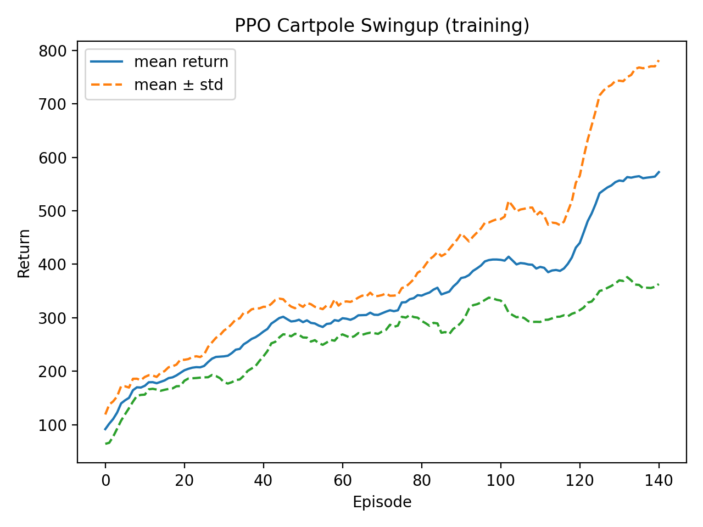
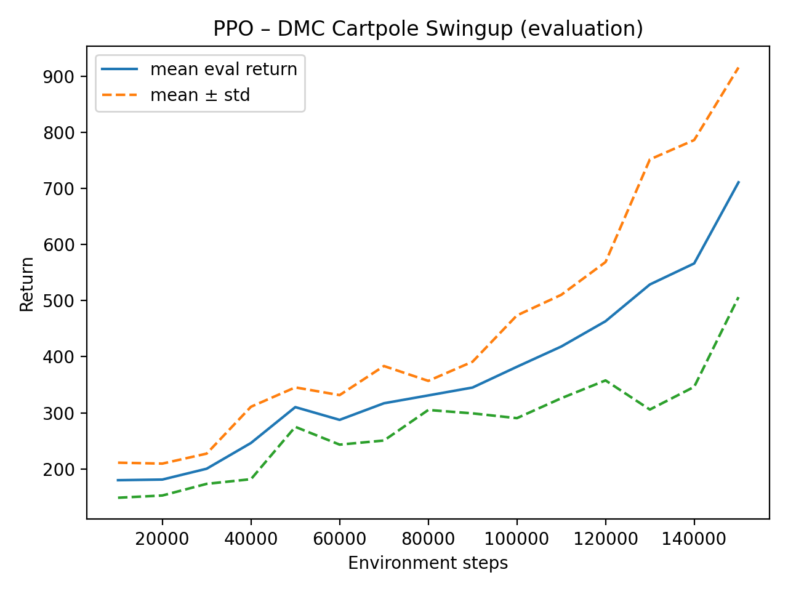

# Solve the Cartpole Swing-Up Control Problem Using Proximal Policy Optimization (PPO)

This repository contains the full implementation, training scripts, evaluation scripts, and analysis for solving a **continuous-control Cartpole Swing-Up** task using **Proximal Policy Optimization (PPO)**.

This project was completed as part of a Reinforcement Learning assignment, with the following main requirements:

- Implement an actor–critic method (PPO).
- Train the control policy using **three seeds** (0, 1, 2).
- Evaluate the policy using **one seed** (10).
- Plot learning curves for both training and evaluation using **mean ± standard deviation**.
- Provide a clear implementation, analysis, and final report.

---

## 📌 Project Structure


---
.
├── ppo_cartpole_train.py # Training script (seeds 0, 1, 2)
├── eval_ppo_seed10.py # Evaluation script (seed 10)
├── plot_ppo_cartpole.py # Plot training/evaluation learning curves
├── ppo_cartpole_training_curve.png
├── ppo_cartpole_eval_curve.png
├── report.tex # IEEE-format LaTeX report
├── requirements.txt # Full list of dependencies
├── README.md # Project documentation
└── .gitignore # Ignore venv and temporary files
---

## 📊 Plots

### Training Curve  
Mean ± std across training seeds.



### Evaluation Curve  
Performance over environment steps.



---

## 🛠 Installation

### Clone the repository:

```
bash
git clone https://github.com/muditkhandelwal16/Solve-the-Cartpole-Swing-Up-Control-Problem-Using-Proximal-Policy-Optimization.git
cd Solve-the-Cartpole-Swing-Up-Control-Problem-Using-Proximal-Policy-Optimization
```
### Create and activate a virtual environment:
```
python -m venv rl_cartpole
# Windows
rl_cartpole\Scripts\activate

```
### Install dependencies:
```
pip install -r requirements.txt
```
## ▶️ How to Run
### 1. Train the agent
```
python ppo_cartpole_train.py
```
### 2. Evaluate the agent
```
python eval_ppo_seed10.py
```
### 3. Generate training/ evaluation plots
```
python plot_ppo_cartpole.py
```

## 📄 Report

### A full IEEE-style report is included:  
- report.tex
### The report discusses:  
-Approach and PPO methodology  
-Hyperparameters  
-Training procedure  
-Evaluation  
-Analysis of results  
-Mean ± std learning curves  

## 🔒 Notes

-The virtual environment (rl_cartpole/) is not included and should not be committed.  
-Use pip install -r requirements.txt to recreate the environment.  
-All figures are automatically generated by the plotting script.  
## 📬 License

This project is for educational use. All rights reserved.
